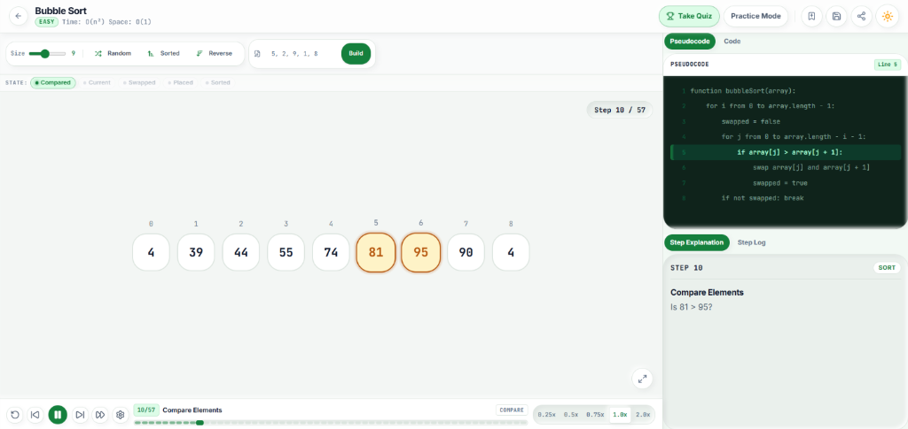
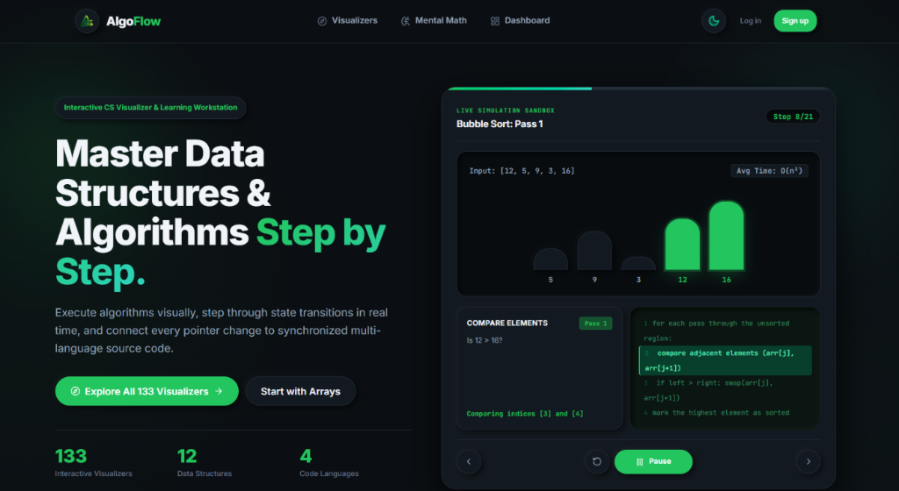
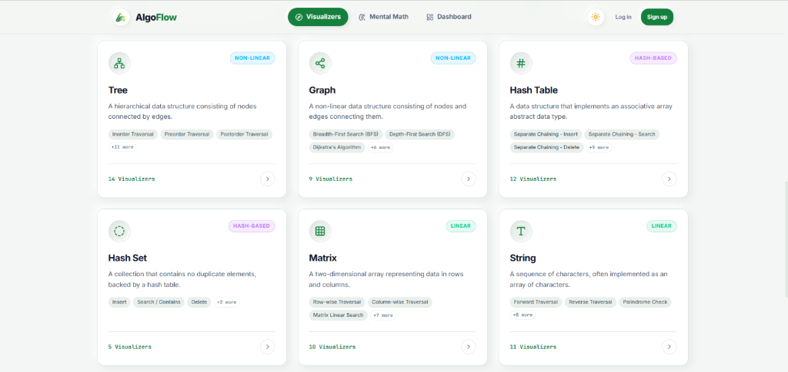
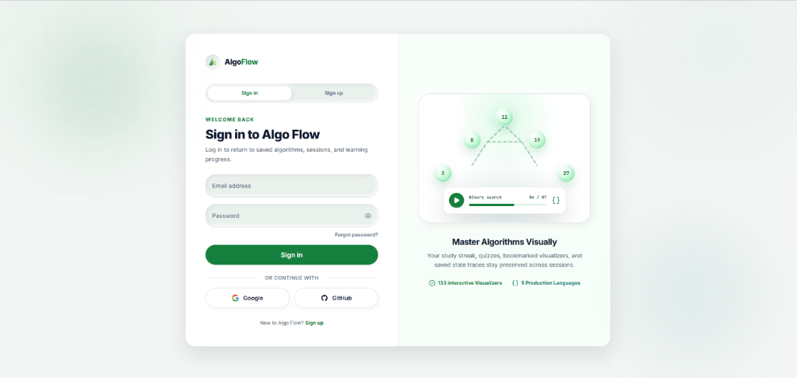

# Algo Flow

Interactive Algorithm & Data Structure Visualizer Workstation with Synchronized Multi-Language Code Tracing.

## Confidentiality & Proprietary Notice

> **PROPRIETARY & CONFIDENTIAL**  
> Copyright © 2026 Nightmare. All Rights Reserved.  
> 
> This repository, its architecture, algorithms, user interfaces, documentation, and source code constitute proprietary software and trade secrets of **Nightmare**. Access is restricted strictly to authorized individuals. Unauthorized copying, reverse engineering, redistribution, decompilation, public display, or commercial exploitation—in whole or in part—is strictly prohibited without prior written authorization from the copyright holder.

---

## Status & Build Badges


---

## Product Preview

Authorized evaluators may review the live deployment at:  
🔗 **Authorized Evaluation URL:** [https://algo-flow-night-sigma.vercel.app](https://algo-flow-night-sigma.vercel.app)

### 1. Interactive Algorithm Workstation (Bubble Sort Tracing — Light Mode)
*Deterministic, step-by-step element comparison, memory swapping, and synchronized pseudocode line mapping.*



### 2. Commercial Landing Experience & Live Simulation Sandbox (Dark Mode)
*Production-ready SaaS interface showcasing tactile neumorphic controls and an integrated interactive sandbox.*



### 3. Comprehensive Data Structure Taxonomy & Catalog
*Searchable index spanning 138 algorithms grouped by data structure family with operational tags.*



### 4. Enterprise Identity & Progress Persistence Portal
*Unified authentication system supporting email/password and OAuth providers with PostgreSQL Row Level Security.*



---

## Overview

**Algo Flow** is a high-performance, interactive Computer Science educational platform and technical interview preparation workstation. It provides deterministic, frame-accurate visualizations of 138 data structures and algorithms, executing step-by-step alongside real-time variable inspections, plain-English step explanations, and synchronized code tracing across four core languages (Python, C++, Java, and JavaScript).

Engineered with Next.js 16, React 19, and a bespoke state-driven playback machine, Algo Flow replaces static diagrams with an interactive runtime environment. Students, software engineers, and hiring candidates can pause, scrub, inspect memory transitions, and test custom data structures—including full graphical editing of arbitrary trees and graphs—delivering deep algorithmic intuition and conceptual mastery.

---

## Core Capabilities & Features

- **138 Interactive Algorithmic Visualizers**: Comprehensive coverage spanning Arrays, Strings, Matrices, Linked Lists, Stacks, Queues, Binary Search Trees, AVL Self-Balancing Trees, Min/Max Heaps, Tries, and Graph Algorithms (BFS, DFS, Dijkstra, Bellman-Ford, Kruskal, Prim, Topological Sort, Cycle Detection).
- **Synchronized Multi-Language Code Tracing**: Real-time line-by-line syntax highlighting matching every visual frame simultaneously across Python, C++, Java, and JavaScript powered by Shiki.
- **Deterministic VCR Playback Engine**: Complete transport controls (Play, Pause, Step Forward, Step Backward, Restart, Skip to End, Timeline Scrubbing, and 0.25x–2.0x variable playback speed) driven by an isolated Zustand state store.
- **Interactive Visual Data Editors**:
  - **Tree Visual Editor**: Node addition, in-place value editing, deletion, sub-tree auto-layout, and automated Binary Search Tree (BST) invariant validation.
  - **Graph Visual Editor**: Interactive canvas using React Flow supporting directed/undirected edges, custom edge weights, arbitrary topologies, and adjacency generation.
  - **Matrix & Array Custom Input**: In-place dimension scaling, arbitrary cell inputs, and automated boundary validation.
- **Self-Balancing AVL Dynamic Engine**: Automatic detection of balance factors ($BF = \text{height}(L) - \text{height}(R)$) with step-by-step pointer rewiring across single (LL, RR) and double (LR, RL) rotations for both preset and custom trees.
- **Comprehension Quizzes & Mental Math Studio**: Contextual algorithm quizzes testing time/space complexity and invariants, alongside a dedicated mental math agility trainer with tactile controls and live calculation simulators.
- **Enterprise-Grade Identity & Persistence**: Cloud session preservation, progress tracking, bookmarks, streaks, and activity analytics backed by Supabase with Row Level Security (RLS).
- **Tactile Neumorphic Design System**: Custom-engineered design tokens, accessible Radix UI primitives, fluid Framer Motion transitions, and instantaneous Dark/Light theme switching.

---

## Technical Architecture & Stack

Algo Flow is architected as a modern, type-safe Next.js application adhering to rigorous separation of concerns between visual rendering, algorithmic execution, and playback orchestration.

| Architectural Layer | Technologies & Dependencies | Role & Implementation |
|---|---|---|
| **Core Framework** | Next.js 16.3.4 (App Router, Turbopack) | Server Components, dynamic slug routing, SSR, API routes |
| **User Interface** | React 19.2.4, TypeScript 5.x | Strictly typed component tree, zero-runtime overhead |
| **Styling & Design Tokens** | Tailwind CSS 4.x, PostCSS | Custom CSS variable design tokens, neumorphic surfaces |
| **Playback State Machine** | Zustand 5.0.14 | Deterministic step indexing, frame coordination, timeline state |
| **Motion & Animation** | Framer Motion 12.42.2 | Spring-based node transitions, pointer rewiring, physics layout |
| **Graph & Canvas Topology** | @xyflow/react 12.11.1 (React Flow) | Node-edge graphical editor canvas, topological rendering |
| **Code Highlighting** | Shiki 4.3.1 | Grammar-accurate multi-language syntax engine |
| **Authentication & Database** | Supabase (@supabase/ssr 0.12, @supabase/supabase-js 2.110) | PostgreSQL persistence, Row Level Security (RLS), OAuth 2.0 |
| **UI Primitives & Icons** | Radix UI, Lucide React 1.23.0 | Accessible popovers, switches, labels, and iconography |
| **Automated Verification** | TypeScript, ESLint 9, tsx scripts | Automated visualizer coordination and registry contract audits |

---

## Project Status & Maturity

- **Current Maturity**: **Production-Ready / Commercial Release Candidate (v0.1.0)**
- **Feature Completeness**: 100% of the planned 138 algorithm visualizer catalog is fully implemented and operational.
- **Verification Gates**: Passes automated prebuild registry audits (`npm run validate:registry`), coordination checks, strict TypeScript type checks (`tsc --noEmit`), and ESLint suites with 0 errors and 0 warnings.
- **Deployment**: Production deployment pipeline live on Vercel with automated security headers and edge caching.

---

## Getting Started (Authorized Evaluators Only)

> **NOTICE**: The following instructions are intended exclusively for authorized developers, auditors, and technical evaluators with authorized repository access.

### Prerequisites

- **Node.js**: `v20.x` or higher (LTS recommended)
- **Package Manager**: `npm v10.x` or higher
- **Supabase Account**: An active Supabase project with database migrations applied (located in `supabase/migrations/`)

### 1. Repository Setup

```bash
# Clone the private repository
git clone <authorized-repo-url>
cd algo-flow

# Install project dependencies
npm install
```

### 2. Environment Configuration

Create a local environment file based on the template:

```bash
cp .env.example .env.local
```

Populate `.env.local` with your designated development credentials (variable names only; do not commit actual values):

```env
# Supabase Configuration
NEXT_PUBLIC_SUPABASE_URL=https://<your-project-ref>.supabase.co
NEXT_PUBLIC_SUPABASE_ANON_KEY=<your-anon-key>
SUPABASE_SERVICE_ROLE_KEY=<your-service-role-key>

# OAuth Providers (Optional for local visualizer testing)
GOOGLE_CLIENT_ID=<your-google-client-id>
GOOGLE_CLIENT_SECRET=<your-google-client-secret>
GITHUB_CLIENT_ID=<your-github-client-id>
GITHUB_CLIENT_SECRET=<your-github-client-secret>

# Application URL
NEXT_PUBLIC_SITE_URL=http://localhost:3000
```

### 3. Verification & Validation Scripts

Algo Flow includes automated validation scripts to ensure all visualizer registry entries, pseudocode mappings, and multi-language code snippets remain synchronized:

```bash
# Validate algorithm registry completeness and contracts
npm run validate:registry

# Verify 4-language code example coverage across all visualizers
npm run verify:code-examples

# Verify step coordination and highlight alignment
npm run validate:visualizers:coordination

# Execute static type checking
npm run typecheck

# Run linter
npm run lint
```

### 4. Running the Application Locally

```bash
# Start local development server with Turbopack
npm run dev
```

Open [http://localhost:3000](http://localhost:3000) in your browser.

### 5. Production Compilation

```bash
# Compiles the production build (automatically triggers registry validation via prebuild)
npm run build

# Start the compiled production build
npm run start
```

---

## Project Structure

```text
algo-flow/
├── public/                     # Static media, icons, and structured assets
├── scripts/                    # Build-time automated verification suites
│   ├── validate-registry.ts    # Enforces visualizer registry data contracts
│   ├── verify-code-examples.ts # Validates Python, C++, Java, JS parity
│   └── validate-visualizer-coordination.ts
├── src/
│   ├── app/                    # Next.js App Router routes & layouts
│   │   ├── (auth)/             # Authentication workflows (login, signup, reset)
│   │   ├── auth/callback/      # Supabase OAuth token exchange route
│   │   ├── dashboard/          # Protected user telemetry & progress dashboard
│   │   ├── visualizer/[slug]/  # Dynamic workstation runtime for 138 algorithms
│   │   ├── visualizers/        # Searchable algorithmic catalog & category filters
│   │   ├── mental-math/        # Interactive mental calculation studio
│   │   ├── quizzes/            # Algorithmic comprehension assessment suites
│   │   └── page.tsx            # Commercial landing & feature presentation page
│   ├── components/             # Reusable UI component modules
│   │   ├── auth/               # Identity and access modal components
│   │   ├── dashboard/          # Analytics and metric widgets
│   │   ├── layout/             # Master navigation, footers, theme toggles
│   │   ├── ui/                 # Accessible primitives (buttons, inputs, cards)
│   │   └── visualizer/         # Core algorithmic visualizer runtime
│   │       ├── controls/       # Input controls (Array, Tree, Graph, Matrix)
│   │       ├── renderers/      # Specialized SVG/Motion visual renderers
│   │       ├── CodePanel.tsx   # Multi-language code tracing inspector
│   │       ├── PlaybackControls.tsx # Transport bar (Play/Pause/Scrub/Step)
│   │       └── VisualizerLayout.tsx # Responsive dual-pane workstation shell
│   ├── data/seed/              # Canonical algorithms, time/space metrics, pseudocode
│   ├── features/               # Domain feature services (bookmarks, streaks, progress)
│   ├── hooks/                  # Custom React application hooks
│   ├── lib/                    # Core utilities, API clients, Supabase adapters
│   │   ├── security/           # Rate limiting and safe parsing utilities
│   │   ├── supabase/           # Server, client, and middleware database clients
│   │   └── validation/         # Input clamping and data structure validators
│   ├── stores/                 # Zustand playback state stores (playback-store.ts)
│   ├── types/                  # TypeScript interface declarations
│   └── visualizers/            # Step generation and algorithmic execution logic
│       ├── array/              # Array operations and algorithms
│       ├── graph/              # Graph traversal and shortest-path engines
│       ├── matrix/             # Matrix transformations and traversals
│       ├── tree/               # BST, AVL rotations, Heap, and Trie engines
│       └── registry/           # Master visualizer registry and lookup engine
├── supabase/                   # PostgreSQL schema definitions, migrations, and RLS
├── package.json                # Project dependencies and operational scripts
└── tsconfig.json               # Strict TypeScript compiler configuration
```

---

## Security & Access Control

- **Private Repository**: Access is strictly limited to authorized personnel. Repository forks, mirror creation, and external redistribution are forbidden.
- **Data Protection & RLS**: All Supabase database tables enforce strict PostgreSQL Row Level Security (RLS) policies. User progress, bookmarks, and private sessions can only be accessed by the authenticated session owner.
- **Edge Security Headers**: Strict HTTP Content Security Policy (CSP), HTTP Strict Transport Security (HSTS), X-Content-Type-Options, and X-Frame-Options are configured at the Next.js runtime level in `next.config.ts`.
- **Zero Secrets Commitment**: No production API keys, service role credentials, or private cryptographic secrets are stored within this repository or its commit history. All runtime environments require independently provisioned secrets.

---

## Ownership & Legal Policies

This software and all associated intellectual property, patents, trade secrets, design assets, and copyright rights are the sole, exclusive property of **Nightmare**.

- **License Agreement**: [LICENSE](LICENSE) (Proprietary Educational & Evaluation Agreement)
- **Security Policy**: [SECURITY.md](SECURITY.md) (Vulnerability Disclosure & SLAs)
- **Terms of Service**: [TERMS.md](TERMS.md) (Platform Terms & Acceptable Use)
- **Privacy Policy**: [PRIVACY.md](PRIVACY.md) (GDPR, CCPA & Data Governance)
- **Cookie Policy**: [COOKIES.md](COOKIES.md) (Zero-Ad-Tracker & Storage Inventory)

---

## Contact & Inquiries

For authorized evaluation inquiries, acquisition discussions, licensing queries, or security reports, contact the copyright owner directly:

- **Owner / Lead Architect**: Nightmare
- **Email**: [ganeshsharma7114@gmail.com](mailto:ganeshsharma7114@gmail.com)
