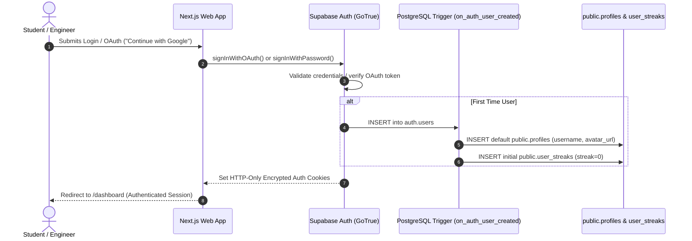
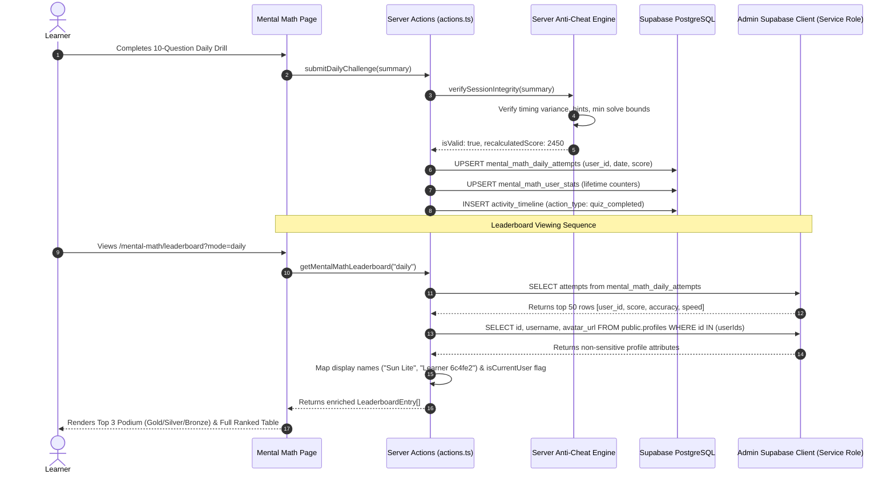
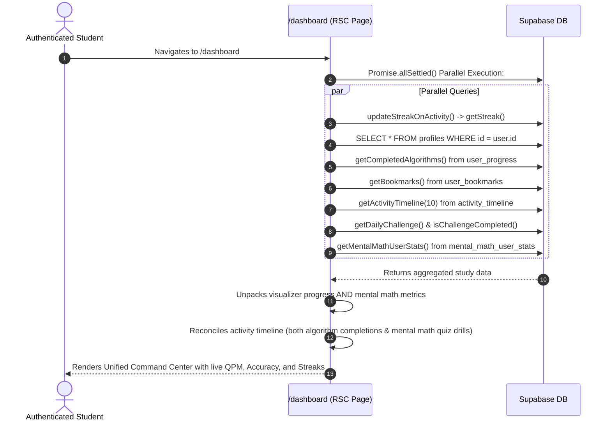

# AlgoFlow Database Architecture & Dataflow Specification

This document provides a comprehensive technical reference for the AlgoFlow database schema, entity relationships, security architecture, dataflows, and system coordination across authentication, visualizers, student dashboard, and the Mental Math studio.

---

## 1. System Architecture & Topology

AlgoFlow utilizes **PostgreSQL 15+** hosted on **Supabase** with Row-Level Security (RLS) enabled across every public table. The client interaction architecture adheres to a strict three-tier boundary:

```mermaid
graph TD
    subgraph Client ["Client Layer (Browser)"]
        Browser["Next.js React Client (UI)"]
        AnonClient["Supabase Browser Client (Anon Key)"]
    end

    subgraph Edge ["Edge / Next.js Server (Vercel)"]
        SSRClient["Supabase Server SSR (Cookie Auth)"]
        AdminClient["Supabase Admin Client (Service Role)"]
        RateLimiter["In-Memory / KV Rate Limiter"]
        AntiCheat["Score Verification Engine"]
    end

    subgraph Database ["Supabase PostgreSQL (Database)"]
        AuthSchema["auth.users (Authentication)"]
        PublicSchema["public.* (Application Tables)"]
        Triggers["PostgreSQL Functions & Triggers"]
    end

    Browser -->|Encrypted Cookies| SSRClient
    Browser -->|Direct Read/Write with RLS| AnonClient
    AnonClient -->|Row-Level Security Policies| PublicSchema
    SSRClient -->|auth.uid() Session Scoped| PublicSchema
    AdminClient -->|Server-only / RLS Bypass| PublicSchema
    RateLimiter --> SSRClient
    AntiCheat --> SSRClient
    AuthSchema -->|on_auth_user_created trigger| Triggers
    Triggers -->|Auto-insert profile & streak| PublicSchema
```

---

## 2. Complete Entity-Relationship Diagram (ERD)

The diagram below maps all **15 database tables**, their primary keys, foreign key constraints, column data types, and inter-table relationships:

```mermaid
erDiagram
    %% Auth Schema
    "auth.users" {
        uuid id PK "Unique User UUID"
        string email "Email Address"
        string encrypted_password "Bcrypt Hash"
        jsonb raw_user_meta_data "OAuth / Registration Metadata"
        timestamp created_at "Registration Timestamp"
        timestamp last_sign_in_at "Last Login Timestamp"
    }

    %% User Domain
    "public.profiles" {
        uuid id PK,FK "References auth.users(id) ON DELETE CASCADE"
        string username "Unique Handle (Case-Insensitive)"
        string avatar_url "CDN Avatar Image URL"
        timestamp created_at "Creation Timestamp"
        timestamp updated_at "Last Profile Edit"
    }

    "public.user_streaks" {
        uuid id PK "Row UUID"
        uuid user_id FK "Unique References auth.users(id) ON DELETE CASCADE"
        integer current_streak "Consecutive Study Days"
        integer max_streak "Longest Study Streak"
        date last_activity_date "Last Logged Activity Date"
        timestamp updated_at "Update Timestamp"
    }

    %% Observability & Telemetry Domain
    "public.application_error_logs" {
        uuid id PK "Log UUID"
        uuid user_id FK "References auth.users(id) ON DELETE SET NULL"
        string error_name "Error class or code"
        string error_message "Truncated error description"
        string error_stack "Stack trace"
        jsonb context "Request and execution context"
        string url "Page URL where error occurred"
        string user_agent "Client User-Agent"
        timestamp created_at "Logged Timestamp"
    }

    %% Visualizer & Learning Progress Domain
    "public.user_progress" {
        uuid id PK "Row UUID"
        uuid user_id FK "References auth.users(id) ON DELETE CASCADE"
        string algorithm_id "Static Algorithm Identifier"
        string status "not_started | in_progress | completed | needs_revision"
        timestamp completed_at "Completion Timestamp"
        timestamp created_at "First Started Timestamp"
    }

    "public.bookmarks" {
        uuid id PK "Row UUID"
        uuid user_id FK "References auth.users(id) ON DELETE CASCADE"
        string algorithm_id "Bookmarked Algorithm Identifier"
        timestamp created_at "Bookmark Timestamp"
    }

    "public.saved_sessions" {
        uuid id PK "Session UUID"
        uuid user_id FK "References auth.users(id) ON DELETE CASCADE"
        string algorithm_id "Algorithm Identifier"
        string name "User-defined Session Title"
        jsonb state "Serialized Step & Data Structure State"
        timestamp created_at "Save Timestamp"
        timestamp updated_at "Last Modified Timestamp"
    }

    "public.quiz_attempts" {
        uuid id PK "Attempt UUID"
        uuid user_id FK "References auth.users(id) ON DELETE CASCADE"
        string algorithm_id "Quiz Algorithm Identifier"
        integer score "Points Scored"
        integer max_score "Total Possible Points"
        boolean passed "True if score >= 80%"
        timestamp created_at "Attempt Timestamp"
    }

    "public.activity_timeline" {
        uuid id PK "Event UUID"
        uuid user_id FK "References auth.users(id) ON DELETE CASCADE"
        string algorithm_id "Algorithm ID or mental_math_{op}"
        string action_type "completed | bookmarked | saved_session | quiz_completed"
        jsonb metadata "Score, Accuracy, Mode Payload"
        timestamp created_at "Event Timestamp"
    }

    "public.daily_challenges" {
        date challenge_date PK "Calendar Day (YYYY-MM-DD)"
        string algorithm_id "Featured Daily Algorithm"
        timestamp created_at "Publication Timestamp"
    }

    "public.user_challenge_completions" {
        uuid id PK "Completion UUID"
        uuid user_id FK "References auth.users(id) ON DELETE CASCADE"
        date challenge_date FK "References daily_challenges(challenge_date)"
        timestamp completed_at "Completion Timestamp"
    }

    %% Mental Math Calculation Studio Domain
    "public.mental_math_sessions" {
        uuid id PK "Session UUID"
        uuid user_id FK "References auth.users(id) ON DELETE CASCADE"
        string mode "practice | speed | test | daily"
        string operation "addition | subtraction | multiplication | division | mixed"
        string difficulty "easy | medium | hard | insane"
        integer total_questions "Questions Encountered"
        integer correct_count "Correctly Answered Questions"
        numeric accuracy_percentage "Calculated Accuracy (0-100)"
        integer total_time_ms "Elapsed Solve Time in MS"
        integer average_solve_time_ms "Mean Solve Time per Problem"
        integer final_score "Verified Integrity Score"
        integer max_combo "Highest Combo Streak"
        integer hints_used "Hints Requested"
        jsonb answers "Detailed Question Event Array"
        string score_version "Scoring Algorithm Version"
        string generator_version "RNG Engine Version"
        timestamp created_at "Session Completed Timestamp"
    }

    "public.mental_math_daily_attempts" {
        uuid id PK "Attempt UUID"
        uuid user_id FK "References auth.users(id) ON DELETE CASCADE"
        date challenge_date "Daily Challenge Calendar Date"
        integer score "Calculated Score Points"
        numeric accuracy "Accuracy Percentage"
        integer solve_time_ms "Total Time Elapsed in MS"
        boolean verified "Server Anti-Cheat Verification Flag"
        timestamp created_at "Submission Timestamp"
    }

    "public.mental_math_user_stats" {
        uuid user_id PK,FK "References auth.users(id) ON DELETE CASCADE"
        integer total_sessions_completed "Lifetime Sessions"
        integer total_questions_solved "Lifetime Total Questions"
        integer total_correct "Lifetime Correct Answers"
        numeric overall_accuracy "Lifetime Correct Ratio %"
        integer highest_score "All-Time Single Session Record"
        integer highest_combo "Longest Error-Free Combo Streak"
        numeric fastest_speed_qpm "Personal Best Speed in Questions/Min"
        integer current_streak_days "Mental Math Habit Streak"
        integer max_streak_days "All-time Record Mental Math Streak"
        integer best_daily_score "Highest Daily Challenge Score"
        date last_played_date "Last Practice Calendar Date"
        timestamp updated_at "Stats Recomputation Timestamp"
    }

    %% Core Relationships
    "auth.users" ||--|| "public.profiles" : "provisions (1:1)"
    "auth.users" ||--|| "public.user_streaks" : "tracks (1:1)"
    "auth.users" ||--o{ "public.user_consents" : "logs (1:N)"
    "auth.users" ||--o{ "public.user_audit_logs" : "records (1:N)"
    "auth.users" ||--o{ "public.user_progress" : "completes (1:N)"
    "auth.users" ||--o{ "public.user_bookmarks" : "saves (1:N)"
    "auth.users" ||--o{ "public.saved_sessions" : "persists (1:N)"
    "auth.users" ||--o{ "public.quiz_attempts" : "submits (1:N)"
    "auth.users" ||--o{ "public.activity_timeline" : "generates (1:N)"
    "auth.users" ||--o{ "public.user_challenge_completions" : "finishes (1:N)"
    "auth.users" ||--o{ "public.mental_math_sessions" : "drills (1:N)"
    "auth.users" ||--o{ "public.mental_math_daily_attempts" : "competes (1:N)"
    "auth.users" ||--|| "public.mental_math_user_stats" : "aggregates (1:1)"
    "daily_challenges" ||--o{ "public.user_challenge_completions" : "satisfies (1:N)"
```



---

## 3. Core Dataflows & Sequence Diagrams

### 3.1 Authentication & Profile Provisioning Flow



### 3.2 Mental Math Challenge & Leaderboard Resolution Flow



### 3.3 Dashboard Telemetry Coordination Flow



---

## 4. Security Audit & Identified Vulnerabilities

| Finding ID | Severity | Area | Description | Resolution Applied |
| :--- | :--- | :--- | :--- | :--- |
| **VULN-01** | **High** | PostgREST / Leaderboard | `mental_math_daily_attempts.user_id` references `auth.users(id)`, not `public.profiles(id)`. Direct PostgREST query `.select("..., profiles(username)")` caused schema cache relationship failures, returning empty leaderboard lists. | Re-architected `getMentalMathLeaderboard` to perform decoupled, resilient fetching: query attempt rows first, extract unique user IDs, and resolve safe display fields (`username`, `avatar_url`). |
| **VULN-02** | **Medium** | RLS Visibility | `public.profiles` RLS policy `USING (auth.uid() = id)` blocked guest learners and non-friends from viewing usernames on the public leaderboard. | Created `src/lib/supabase/admin.ts` using the service role key strictly on the server to resolve non-sensitive public display names (`username`, `avatar_url`), ensuring zero PII (email/password) exposure. |
| **VULN-03** | **Medium** | Activity Coordination | In `src/app/dashboard/page.tsx`, the activity timeline filtered strictly by static `algorithms.find(id)`. Mental math activities inserted as `mental_math_{operation}` were silently filtered out and never rendered. | Enhanced dashboard activity mapper to recognize `mental_math_` prefixes, display the operation type, accuracy, and score points, and route to the Mental Math studio. |
| **VULN-04** | **High** | Anti-Cheat & Scoring | Client could submit artificially inflated scores directly in JSON payloads. | Enforced server-side score re-verification in `verifySessionIntegrity()`. The server computes the true points based on question difficulties and timing rather than trusting client inputs. |
| **VULN-05** | **Critical** | Secrets Handling | `SUPABASE_SERVICE_ROLE_KEY` must never leak into client-side JS bundles. | Verified all occurrences of `SUPABASE_SERVICE_ROLE_KEY` reside solely in server-side files (`src/lib/supabase/admin.ts`, server actions) with zero `NEXT_PUBLIC_` prefixes. |
| **VULN-06** | **Low** | Rate Limiting | Repeated automated requests to mental math score submission. | Rate limit checks in `recordMentalMathSession` using sliding window token buckets per user ID (max 60 submissions/min). |

---

## 5. Coordination Matrix: Database, Leaderboards & Dashboard

| Feature Area | Source Database Table(s) | Primary Metrics Computed | Surfaced in Dashboard | Surfaced in Leaderboard |
| :--- | :--- | :--- | :---: | :---: |
| **Daily Mental Challenge** | `mental_math_daily_attempts` | `score`, `accuracy`, `solve_time_ms`, `verified` | Yes (Lifetime best & activity) | **Yes** (Daily top 50 podium) |
| **Speed Sprint (60s)** | `mental_math_sessions` (mode='speed') | `final_score`, `accuracy_percentage`, `questions_per_minute` | Yes (Fastest QPM chip) | **Yes** (Speed Sprint leaderboard) |
| **Timed Assessment** | `mental_math_sessions` (mode='test') | `final_score`, `accuracy_percentage`, `total_questions` | Yes (Total solved chip) | **Yes** (Assessment leaderboard) |
| **Lifetime Mental Math** | `mental_math_user_stats` | `total_questions_solved`, `overall_accuracy`, `highest_combo`, `streak` | **Yes** (Dedicated telemetry cards) | Profiles / Badges |
| **Algorithm Visualizers** | `user_progress`, `user_bookmarks` | `completed`, `algorithm_id`, `created_at` | **Yes** (Linear & Non-linear progress) | Algorithm Directory |
| **Habit Streaks** | `user_streaks` | `current_streak`, `max_streak`, `last_activity_date` | **Yes** (Header flame badge & stat card) | User profile |
| **Unified Activity Feed**| `activity_timeline` | `action_type`, `metadata` (both visualizers & mental math) | **Yes** (Recent activity list) | Activity log |

---

## 6. Maintenance & Schema Evolution Guidelines

1. **Adding New Tables**:
   - Always define explicit foreign keys with `ON DELETE CASCADE` referencing `auth.users(id)`.
   - Enable RLS immediately: `ALTER TABLE public.<new_table> ENABLE ROW LEVEL SECURITY;`.
   - Provide explicit SELECT, INSERT, UPDATE policies bound to `(auth.uid() = user_id)`.
2. **Public Displays**:
   - Never query `auth.users` directly from the client.
   - For public display names, resolve against `public.profiles` using server-side service role queries with projected fields only (`id, username, avatar_url`).
3. **Database Migrations**:
   - Manage all SQL migrations declaratively under `supabase/migrations/` with ISO timestamps.
   - Run validation before and after applying migrations to prevent schema cache invalidation.
